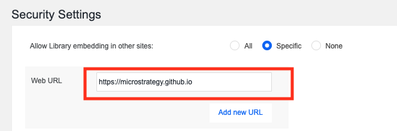
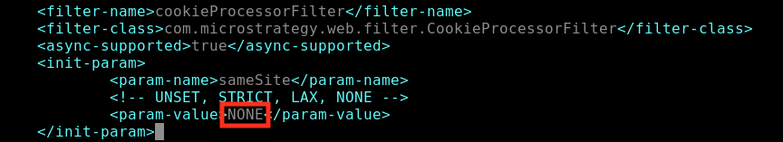
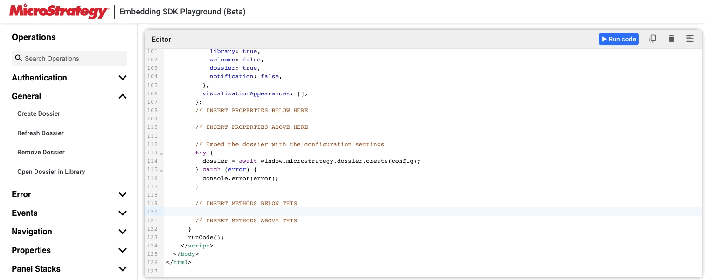
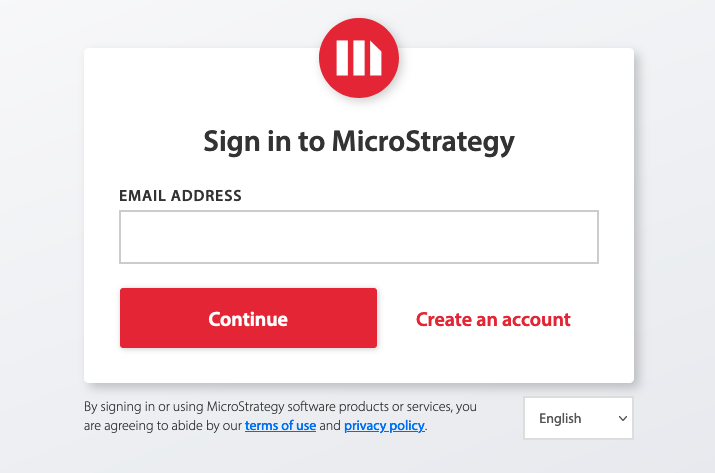

# Embedding SDK Playground User Manual

[Embedding SDK Playground](https://microstrategy.github.io/playground/) provides a way to use our Embedding SDK right away.

## Getting Started

### Requirements for Embedding

If you plan to use your own dossier in the Playground, please meet the following prerequisites.

#### Enable Cross-Origin Resource Sharing (CORS)

Cross-Origin Resource Sharing (CORS) provides a way for a web application running in one origin (domain, protocol, and port) to access selected resources from a server in a different origin. A cross-origin HTTP request uses additional HTTP headers to tell the browser to let the web application share resources. For security reasons, browsers restrict cross-origin HTTP requests initiated from scripts. This means that when a web application requests HTTP resources from a different origin, the response from the other origin must include the right CORS headers.

To enable CORS for the Playground to embed:

1. Open the Library Admin page. Your URL should be similar to the following:

    ```
    https://<host_name>:<port>/MicroStrategyLibrary/admin
    ```

2. Navigate to Library Server -> Security Settings.
3. Allow Library to be embedded in the Playground using url `https://microstrategy.github.io`. You could check `All`, but whitelisting is recommended. 
      
4. Restart your Library Server.


Using the Library Admin page is the easiest way to enable CORS for the REST Server, but you can also configure CORS manually.

1. Navigate to `MicroStrategyLibrary/WEB-INF/classes/config/configOverride.properties`.
2. Edit the configOverride.properties file in a text editor.
3. Add the following lines, or replace them if already present:
    ```
    auth.cors.origins=https://microstrategy.github.io
    security.allowedOrigins=https://microstrategy.github.io
    ```

4. Restart your MicroStrategy Library Server.

#### SameSite Cookie

Google Chrome (version 80+) and Microsoft Edge (version 86+) introduced new changes that may impact embedding.

For Embedding SDK to function as expected in a 3rd party context, it is required to explicitly label session cookies with `SameSite=None; Secure`. Please perform the following steps on your MicroStrategy Library Server machine. 

1. If context.xml doesn't already exist in the following folder location, create it:
MicroStrategyLibrary\META-INF\context.xml

    Add the following to context.xml:
    
    ```xml
    <Context>
      <CookieProcessor sameSiteCookies="None"/>
    </Context>
    ```

2. Modify the `cookieProcessorFilter` declaration highlighted below in MicroStrategyLibrary\WEB-INF\web.xml. Change the `param-value` of sameSite to `NONE`. 

      

3. Restart your MicroStrategy Library Server.

For more information, see [Chrome v80 Cookie Behavior and the Impact on MicroStrategy Deployments](https://community.microstrategy.com/s/article/Chrome-v80-Cookie-Behavior-and-the-impact-on-MicroStrategy-Deployments?language=en_US).

### Use Demo Dossiers

To start, you can use the demo dossier to explore the capabilities of our Embedding SDK. You can also choose your dossier instead by opening the dossier in Library and copying the URL.

After selecting a dossier, you will see the code editor with some default HTML code, the operations menu with Embedding SDK operations to the left, the preview panel with the embedded dossier towards the bottom, and the events panel to the top right.


### Use Your Dossier

You can also use your dossier by entering your dossier URL after selecting _Your Dossier_ tab.


## Interacting with Embedding SDK Playground

### Drag and Drop

To interact with our SDK, drag and drop an operation from the left into the code editor. If you are unsure what an operation does, hover over the tooltip and press learn more to be linked to the documentation. A code snippet will be generated in the editor that reflects the operation. You can press "Run code" button or the shortcut keys to execute the code and see the results loaded in the preview panel.

Note: Make sure to drag operations to the appropriate location in code. Operations that need to be changed before a dossier is loaded should be dragged before it is loaded in code. Operations that need the dossier to be loaded first should be dragged after it is loaded in code. See the comments in the code editor for more details.



### Manually Edit Code

Once you get familiar with the SDK, you can also directly modify the code in the editor without needing to drag and drop any operations. The editor accepts code in HTML, however be wary that modifications to the code may also require manual changes to the drag and drop code afterward.


### Resize or Collapse Panels

You can resize or collapse each panel of the Embedding SDK Playground as you like. When hovering over the gap between panels, you will see a blue line indicating that you can drag and resize the panels. There is also a button to collapse the panel if you don't need it.


### Observe Events and Logs in Event Panel

Whenever you interact with the embedded dossier, the events fired by the interactions will be captured by the event handler and logged in the event panel. These events can be changing pages, applying filters, switching panel stacks, and more.

Note: The event handler looks for the embedded dossier by the name `dossier`. If you change the default code, make sure to keep the embedded dossier object under that name if you want the event handler to catch it.


### Observe Logs in Log Panel

For operations that give output, you can use `console.log(ANYTHING_YOU_WANT_TO_LOG)` to see it in the console or use developer tools provided by your browser. It will also show errors that arise either in syntax or code execution.


### Light / Dark Modes

To switch between light and dark modes, you can click on the toggle on the top right corner, which has a sun or moon.


## Shortcuts

### Run code

- Windows or Linux: `Ctrl + s`
- macOS: `Command + s`

## Troubleshooting

### Embedding SDK Playground is frozen / not responding

Your code in the Code Panel might introduce some infinite loop or other bugs. Please try to delete the local storage of "https://microstrategy.github.io".

- Chrome:
  - Right click on the web page and select "Inspect".
  - Select "Application" tab.
  - Under "Storage" section, expand the "Local Storage".
  - Right click "http://microstrategy.github.io" and select "Clear".
- Safari:
  - Right click on the web page and select "Inspect Element".
  - Select "Storage" tab.
  - Under "Storage" section, expand the "Local Storage".
  - Select "microstrategy.github.io" and click "Delete" button (trash can icon).
- Firefox:
  - Right click on the web page and select "Inspect".
  - Select "Storage" tab.
  - Under "Storage" section, expand the "Local Storage".
  - Right click "http://microstrategy.github.io" and select "Delete All".

## FAQ

### Where can I learn more about the Embedding SDK Playground or Embedding SDK?

You can learn more about the Embedding SDK at its [documentaton site](https://www2.microstrategy.com/producthelp/Current/EmbeddingSDK/Content/topics/Intro_to_the_Embedding_SDK.htm) and watch this [tutorial playlist](https://www.youtube.com/playlist?list=PL2K8Xb9vcI4XHedNmio1JdWs3gI8kwfwR) to learn more about the Embedding SDK Playground.

### How do I find a particular operation?

You can use the search bar to find the operation by name.

### How do I save the code?

The code is automatically saved locally to your browser. As long as you don't clear your local storage, it will be saved.

### How do I select another dossier after I picked one already?

Press the "Start over" button on the navigation bar.

### How can I use this code in my application?

You can copy the entire HTML code in the editor, make modifications to suit your needs, and use it directly as your HTML file in your application.

### How can I revert my changes after making some code error?

All default key commands still work. You can do `Ctrl + z` or `Command + z` to undo your most recent change.

### Where can I find more information about each operation?

When you hover over the operations, you will see an info icon. When you hover over the info icon, you will see a tooltip with a "Learn More" link. By clicking the "Learn More" link, you will be redirected to the specific page of the Embedding SDK documentation, which contains more information about the operation you are interested in.

### How can I report bugs or provide feedback?

You can create new issues or provide feedback under the "Issues" tab, or you can click [here](https://github.com/MicroStrategy/playground/issues/new) to create a new issue or provide feedback.

### What account should I use to log in to the Embedding SDK Playground?

You should use the account created on www.microstrategy.com, not MicroStrategy Library Server login credentials.

Or you can use the account created by following the workflow after clicking the "Create an account" button on the login page.


